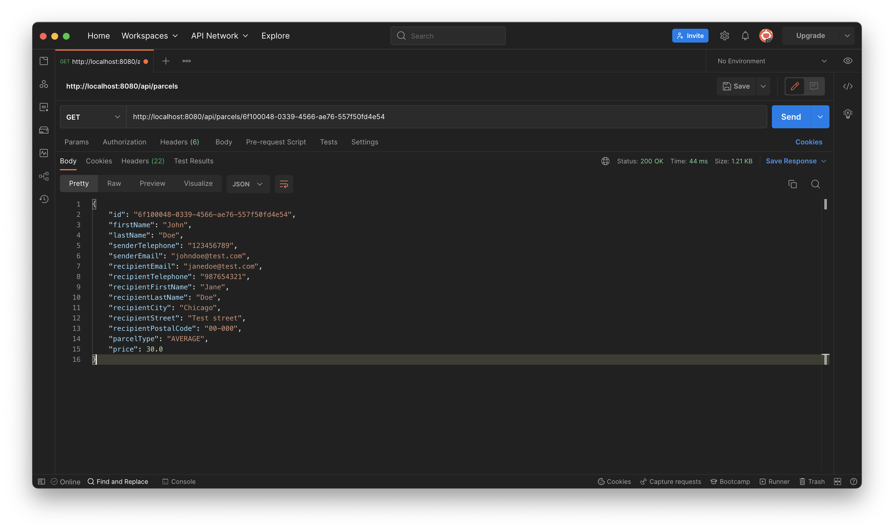
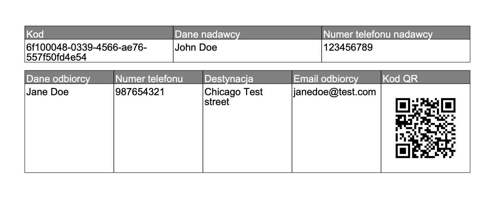

 **INPARCEL SPRING BOOT APPLICATION 1.4** 

Technologies: 
- JAVA 17
- SPRING BOOT 2.7.2
- MySQL
- Hibernate
- Paypal API

Endpoints:

- /api/parcels

Returning list of all parcels in database.

- /api/parcels/[:id]

Example response from endpoint using specific parcels id. 

- /api/parcels/[:id]/label

Example label for parcel with given id.

- /api/parcels/[:id]/csv

Returns a csv file with parcel details.

- /api/depots/

Returns a list with all depots saved in database.

- /api/depots/[:id]

Returns specific depot with given id.

- /api/suppliers

Returns a list with all suppliers saved in database.

- /api/suppliers/[:supplierCode]

Returns a specific supplier using their supplier code.

- /api/routes/[:id]/parcelId

Returns a route history with given parcel id.

- /api/routes/[:username]/username

Returns a route history of the specific user.

- /api/routes/all/users

Returns all routes from all users.

- /api/users/[:username]

Returns specific user with given username.

Basically this project is used for GUI application as a backend server that communicates with database. 
If you want to find out more, check [GUI project](https://gitlab.com/sebastiansoja/warehouse-web-app-fr).

